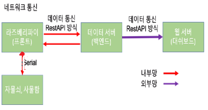
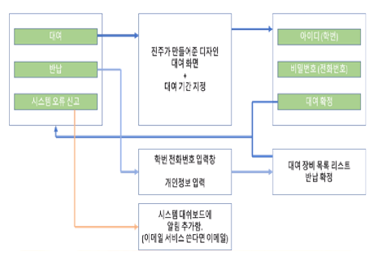

### 개별 역할
 - 진주 : 디자인
 - 미선 : 프론트
 - 차차 : 서버, 환경설정, 아두이노

  

### 통신
  
아두이노 : 시리얼 통신 
서버 : 이더넷 케이블 / 랜선 통신 

  

### 개인 식별 : 
- 학번 및 전화번호 이용
- 동아리 가입 시 사용한 데이터와 대조

  

### UI 흐름도

  

### 키오스크 : 
1. 사용자의 터치 디스플레이 입력을 받아 어떤 장비를 어느 기간까지 빌릴지 결정
2. 사용자의 입력 데이터를 DoD 서버에 전송해 동기화
3. 사물함 좌물쇠, 반납 자물쇠를 on/off 함.
4. DoD 서버가 응답하지 않는 경우 로컬 DB에 저장. 응답하게 될 겨웅 데이터 일괄 전송

   

### 대여 가능 항목 :
1. 책
2. 컴퓨팅 리소스(ex. 서버)
3. 장비 (ex. 라즈베리파이, 아두이노)

   

### 아두이노 통신
 - 보드레이트 : 9600
 - 장비통신 확인 : 장비의 연결 상태 체크
 - comment : 인식번호

   

### 서버 개발
 - 개인 PC에서 개발
 - github 쪽에서 아두이노, 서버 배포

   

### 사용 기술
 - 프론트 : vue.js
 - 백엔드 : ASP.NET core

   

### 희망 사용 기술
- 유닛테스트
- 모니터링도구
- 깃허브 이슈, 프로젝트 관리툴
- 문서 자동화 관리

   

### 개인 역할 분담
 - 미선 : json method, base64 ascord 문제 풀어보기, 문서 읽어보기, git branch 등등 학습
